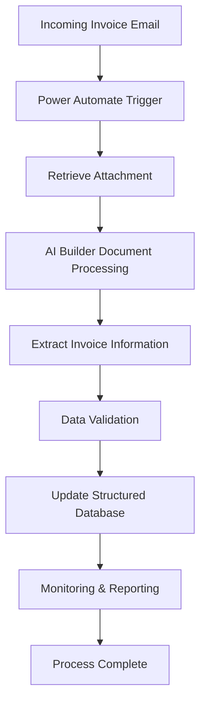

# Lotus Workflow Prototype

## Overview

Lotus Workflow Prototype is a Power Automate-based document processing solution designed to automate invoice handling and data extraction processes. The workflow leverages Microsoft Power Automate and AI Builder to reduce manual effort, improve data accuracy, and streamline document processing activities.

This repository contains a prototype version created for portfolio and demonstration purposes. Sensitive business information, datasets, connections, and proprietary configurations have been removed or anonymized.

## Problem Statement

Invoice processing often requires repetitive manual data entry, validation, and record management. As document volumes increase, these tasks become time-consuming and prone to human error.

The objective of this workflow is to automate the extraction and processing of invoice information, enabling faster handling and more reliable data management.

## Solution Architecture

## Key Features

* Automated invoice document processing
* AI-powered information extraction
* Structured data storage
* Reduced manual data entry
* Improved process consistency
* Scalable workflow architecture

## Technologies Used

* Microsoft Power Automate
* Microsoft AI Builder
* Microsoft Excel Online
* Outlook Integration
* Business Process Automation

## Project Impact

* Reduced repetitive manual processing activities
* Improved operational efficiency
* Increased data consistency and accuracy
* Standardized invoice handling workflow
* Enhanced visibility for monitoring and reporting

## Repository Notice

This repository contains a prototype implementation intended solely to demonstrate workflow architecture, automation logic, and technical capabilities.

All confidential information, business-specific processes, datasets, file structures, email addresses, and production configurations have been removed or modified to protect proprietary information.

## Skills Demonstrated

* Process Automation
* Intelligent Document Processing
* Workflow Design
* Data Management
* Business Process Optimization
* Low-Code Development
* Digital Transformation

## Author

Zahran Putera Maulana

Mechanical Engineer | Process Automation | Supply Chain & Operations

LinkedIn: [Add LinkedIn URL]

GitHub: [Add GitHub URL]
